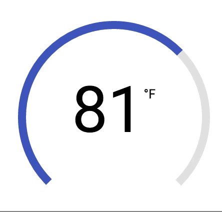

# radial-meter
Polymer element for displaying metrics. Great for dashboards.

## To Do
- [x] Support for negative minimums and values
- [ ] Add unit tests
- [ ] Add support for multiple sizes
- [ ] Add gradient options
